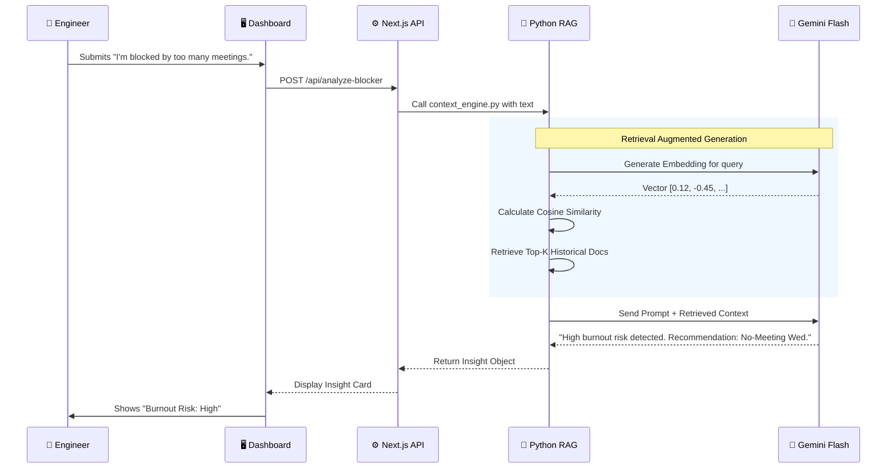

# System Architecture & Workflow

## 🏗️ Technical Architecture
WellLoop AI utilizes a **Hybrid Architecture** combining a high-performance Next.js Frontend with a specialized Python RAG Engine for complex analysis.

```mermaid
graph TD
    subgraph "Frontend Layer (vercel)"
        UI[Next.js 14 UI] -->|User Interaction| API[Next.js API Routes]
        API -->|JSON Response| UI
    end

    subgraph "Logic Layer"
        API -->|HTTP/Shell Call| RAG[Python Context Engine]
        RAG -->|JSON Data| API
    end

    subgraph "AI & Data Layer"
        RAG --"1. Vectorize"--> GEMINI[Google Gemini API]
        GEMINI --"2. Embeddings"--> RAG
        RAG --"3. Cosine Sim"--> VEC[Vector Store (In-Memory)]
    end

    classDef next fill:#000000,stroke:#fff,color:#fff;
    classDef py fill:#3776ab,stroke:#fff,color:#fff;
    classDef google fill:#8e24aa,stroke:#fff,color:#fff;
    
    class UI,API next;
    class RAG,VEC py;
    class GEMINI google;
```

---

## 🔄 Data Workflow: From Survey to Insight
This sequence diagram illustrates how a user's role-based response is processed into a predictive insight.


